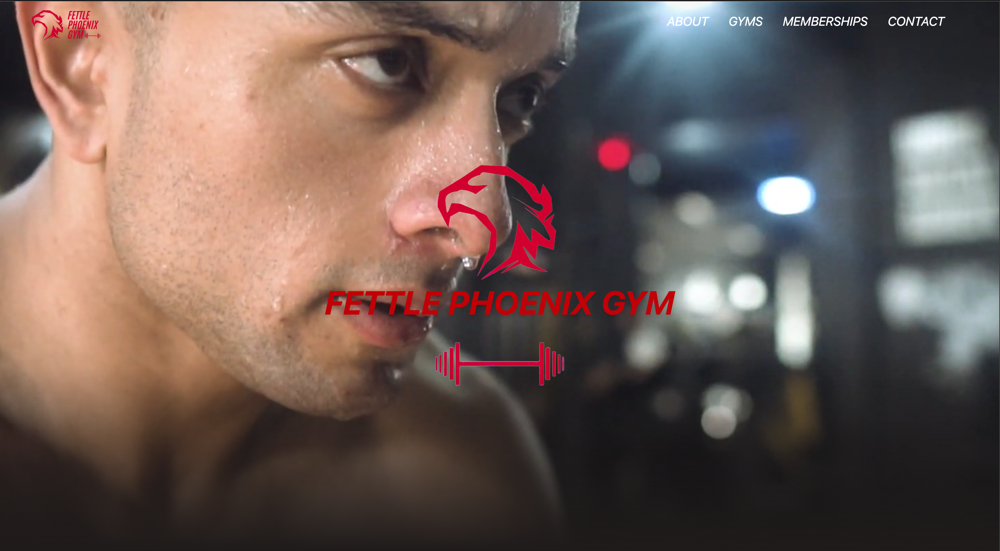
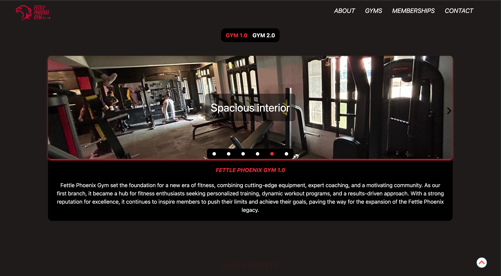
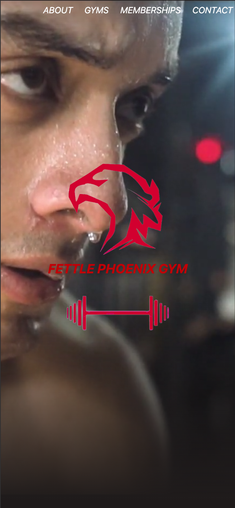
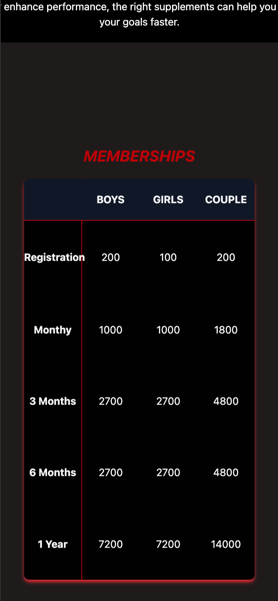

# Fettle Phoenix Gym

A modern, responsive gym and fitness website designed to provide users with an engaging online experience while showcasing gym facilities, services, trainers, membership plans, and contact information.

🌐 **Live Website:** https://kunalkc.github.io/Fettle-Phoenix-Gym/

---

# Preview






<div style="display: flex; flex-wrap: wrap; gap: 10px;">
  
  
  
</div>

---

# Features

- Modern and visually appealing landing page
- Fully responsive design for desktop, tablet, and mobile
- Hero section with call-to-action
- Gym services showcase
- Professional trainers section
- Membership plans
- About the gym section
- Contact information
- Smooth scrolling navigation
- Clean and intuitive user interface

---

# Tech Stack

### Frontend

- HTML5
- CSS3
- JavaScript
- Tailwind

### Tools

- Git
- GitHub
- VS Code

### Deployment

- GitHub Pages

---

# Project Structure

```text
Fettle-Phoenix-Gym
│
├── assets/
│
├── css/
│
├── js/
│
├── images/
│
├── index.html
│
└── README.md
```

---

# Getting Started

## Clone the repository

```bash
git clone https://github.com/Kunalkc/Fettle-Phoenix-Gym.git
```

## Navigate to the project

```bash
cd Fettle-Phoenix-Gym
```

## Open the website

Simply open `index.html` in your browser.

Or use the VS Code Live Server extension.

---

# Website Sections

- Home
- About
- Services
- Trainers
- Membership Plans
- Contact

---

# Design Goals

This project was built with the following objectives:

- Create a clean and modern fitness website
- Ensure a fully responsive layout
- Improve user experience with intuitive navigation
- Showcase a professional gym brand
- Maintain fast loading performance

---

# Live Demo

**Website**

https://kunalkc.github.io/Fettle-Phoenix-Gym/

---

# Repository

**GitHub**

https://github.com/Kunalkc/Fettle-Phoenix-Gym

---

# Author

**Kunal Chandel**

- Portfolio: https://kunalkchandel.com/dev
- GitHub: https://github.com/Kunalkc
- LinkedIn: https://www.linkedin.com/in/kchandel/

---

# License

This project is licensed under the MIT License.

---

## If you found this project useful, consider giving it a ⭐ on GitHub!
````
